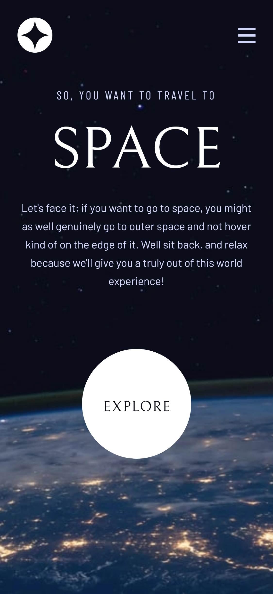
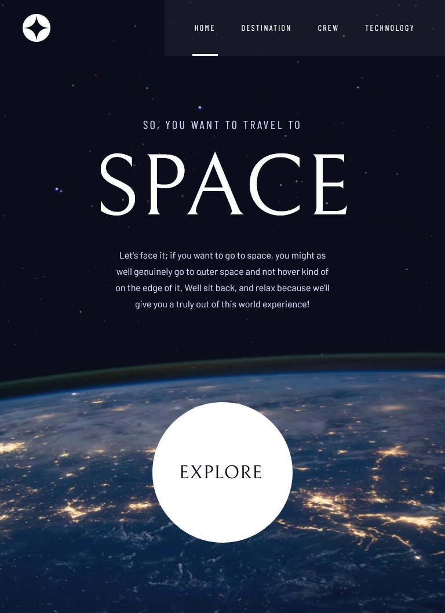
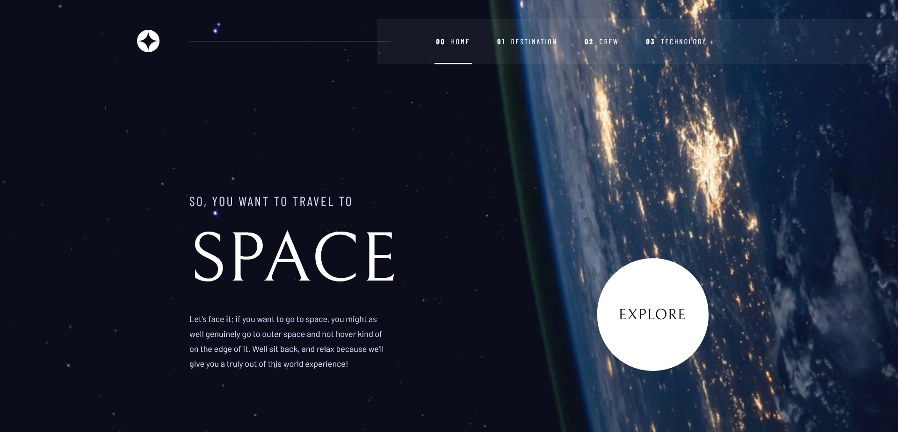
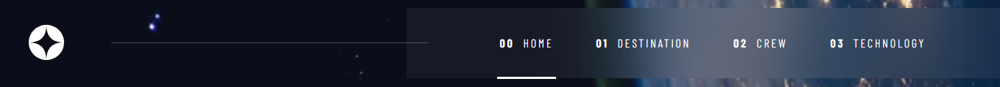

<!-- @format -->

# Frontend Mentor - Space tourism website solution

This is a solution to the
[Space tourism website challenge on Frontend Mentor](https://www.frontendmentor.io/challenges/space-tourism-multipage-website-gRWj1URZ3).
Frontend Mentor challenges help you improve your coding skills by building realistic projects.

## Table of contents

- [Overview](#overview)
  - [The challenge](#the-challenge)
  - [Screenshots](#screenshots)
  - [Links](#links)
- [My process](#my-process)
  - [Built with](#built-with)
  - [What I learned](#what-i-learned)
  - [Continued development](#continued-development)
- [Author](#author)

## Overview

### The challenge

Users should be able to:

- View the optimal layout for each of the website's pages depending on their device's screen size
- See hover states for all interactive elements on the page
- View each page and be able to toggle between the tabs to see new information

### Screenshots

#### Mobile view

#### Table view

#### Desktop view

### Links

- Live Site URL:
  [https://space-tourism-multi-page-website-chi.vercel.app/](https://space-tourism-multi-page-website-chi.vercel.app/)

## My process

### Built with

- Semantic HTML5 markup
- Flexbox
- CSS Grid
- Mobile-first workflow
- [TypeScript](https://www.typescriptlang.org/) - Programming language that builds on JavaScript
- [Next.js](https://nextjs.org/) - React framework
- [Tailwind CSS](https://tailwindcss.com/) - CSS framework
- [usehooks-ts](https://usehooks-ts.com/) - React hook library
- [headlessUI](https://headlessui.com/) - UI components library

### What I learned

During the course of this project, I have learned to fully customize specs Tailwind CSS to fit my needs. This project,
due to its tricky desktop layout, helped me to understand the importance of the layouts themselves - that each page on
the web have its own unique layout, and we have to use various CSS tricks to achieve this layout. I am referring here to
the navigation bar (desktop view) element of this project:

where the logo itself is outside the main layout and the background blur of the navigation bar goes all the way up to
the right side of the screen.

The project also helped me to organize my knowledge about Next.js routing - especially the dynamic routes.

### Continued development

In the future projects, I hope I will be able to implement all the knowledge I have gathered when working on this
project. Especially the mobile-first workflow, considering the final desktop layout. Also, in the future projects I want
to start adding basic animations using for example [Framer Motion](https://www.framer.com/motion/), so my projects/pages
won't be static, boring pages.

## Author

- Frontend Mentor - [@Owczarek-Kamil](https://www.frontendmentor.io/profile/Owczarek-Kamil)
